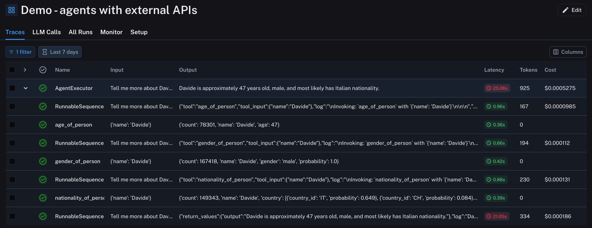

# llm-experiments

This repo that captures experiments with OpenAI models and other LLM-related frameworks

## How to run
1. To run [`1_openai_api_demo.py`](#1_openai_api_demo---prompt-and-response), set the OPENAI_API_KEY env variable
2. To run [`2_langchain_demo.py`](#2_langchain_demo---prompt-and-response), set the OPENAI_API_KEY env variable
3. To run [`3_pdf_demo.py`](#3_pdf_demo---prompt-and-response), set the OPENAI_API_KEY and the TOKENIZERS_PARALLELISM=false env variables
4. To run [`4_youtube_demo.py`](#4_youtube_demo---prompt-and-response), set the OPENAI_API_KEY and the TOKENIZERS_PARALLELISM=false env variables
5. To run [`5_agents_demo.py`](#5_agents_demo---prompts-and-responses), set the OPENAI_API_KEY env variable
6. To run [`6_agents_with_external_apis_demo.py`](#6_agents_with_external_apis_demopy---prompt-and-response), set the OPENAI_API_KEY env variable
7. To run [`7_langgraph_demo.py`](#7_langgraph_demo---prompts-and-responses), set the OPENAI_API_KEY env variable
8. To run [`8_langgraph_tavily_demo.py`](#8_langgraph_tavily_demo---prompts-and-responses), set the OPENAI_API_KEY and the TAVILY_API_KEY env variables
9. To run [`9_pydantic_demo.py`](#9_pydantic_demo---prompts-and-responses),  set the OPENAI_API_KEY env variable
10. To run [`10_agents_with_chainlit_demo.py`](#10_agents_with_chainlit_demo---prompts-and-responses),  set the OPENAI_API_KEY env variable

Note about LangSmith - to be able to use LangSmith's tracing capabilities, you will have to set the following env variables:
1. LANGCHAIN_TRACING_V2=true
2. LANGCHAIN_ENDPOINT="https://api.smith.langchain.com"
3. LANGCHAIN_API_KEY="<your-api-key>"
4. LANGCHAIN_PROJECT="<name-of-project>"

## 1_openai_api_demo - prompt and response
Prompt:
```commandline
I want you to greet how any first computer science program usually greets the world, followed with a smiley
```

Response:
```commandline
Hello World! :)
```

## 2_langchain_demo - prompt and response
Prompt:
```commandline
I want you to greet how any first computer science program usually greets the world, followed with a smiley
```

Response:
```commandline
Hello World! :)
```

## 3_pdf_demo - prompt and response

Prompt:
```commandline
"According to given context, create a list of the different ways a batsman can get out"
```

Response:
```commandline
Based on the provided context, here is a list of different ways a batsman can get out in cricket:

1. Run out
2. Caught
3. Obstructing the field
4. Stumped
5. Hit the ball twice
6. LBW (Leg Before Wicket)
7. Hit wicket

These are the various ways a batsman can be dismissed according to the Laws of Cricket 2017 Code.
```

## 4_youtube_demo - prompt and response
Prompt:
```commandline
Answers based on the provided context. Which car model is this review about? What is the overall summary about Nissan Juke? Tell me the top 3 positives and top 3 negatives
```

Response:
```commandline
This review is about the Nissan Juke. The overall summary of the review is that the Nissan Juke has received updates and improvements, including a new engine, a bigger boot, and some styling upgrades. The reviewer mentions that the Juke has a unique and quirky design, good in-car storage, and a raised driving position that provides great visibility. However, the reviewer also mentions some negatives, such as the fidgety ride, lack of front-end grip in corners, and limited space in the back seats.

Top 3 positives:
1. Unique and quirky design
2. Good in-car storage
3. Raised driving position for better visibility

Top 3 negatives:
1. Fidgety ride
2. Lack of front-end grip in corners
3. Limited space in the back seats
```

## 5_agents_demo - prompts and responses

Prompt 1: Note that this prompt is **automagically calls** the custom `get_word_length` method that I defined
```commandline
How many letters are there in the word blaaaaah?
```

Response 1:
```commandline
There are 8 letters in the word "blaaaaah".
```

Prompt 2: Note that this prompt **does not** call the custom `get_word_length` method that I defined, even though the invoking logic is the same
```commandline
Translate the spanish word 'Amigo' to English
```

Response 2:
```commandline
The Spanish word "Amigo" translates to "Friend" in English.
```

## 6_agents_with_external_apis_demo.py - prompt and response
Prompt:
```commandline
Tell me more about Davide
```

Response
```commandline
Davide is estimated to be around 47 years old. The name Davide is most commonly associated with males, with a probability of 1.0. In terms of nationality, the name Davide is most likely associated with Italy (probability of 0.649), followed by Switzerland, Portugal, Belgium, and Luxembourg.

```

Note - I also attached this run to LangSmith to use Tracing. This is the visual that LangSmith created for this run:



## 7_langgraph_demo - prompts and responses
Prompt:
```commandline
Tell me more about Davide
```

Response
```commandline
Davide is a male name and is most commonly associated with individuals who are around 47 years old. The name Davide is most likely of Italian origin, with a probability of 64.9%. It is also associated with other nationalities such as Swiss (8.4%), Portuguese (3.0%), Belgian (1.1%), and Luxembourgish (1.1%).

```


## 8_langgraph_tavily_demo - prompts and responses
Prompt:
```commandline
Whats's the weather in London like?
```

Response:
```commandline
The weather in London is currently transitioning to milder, wetter, and windier conditions. For more detailed and up-to-date information, you can visit the [Met Office website](https://www.metoffice.gov.uk/weather/forecast/gcpvj0v07).
```

## 9_pydantic_demo - prompts and responses
Prompt:
```commandline
India wicketkeeper Rishabh Pant has been passed fit to play in the Indian Premier League (IPL) 
after a 14-month absence from cricket.

Pant, 26, has not played since being injured in a serious car accident in December 2022.

It has been confirmed that Pant will play for Delhi Capitals in the upcoming IPL season, which starts on 22 
March.

Should Pant show he can keep wicket well, he could feature in India's squad for the Men's T20 World Cup in June.

The Board of Control for Cricket in India (BCCI) said in a statement posted on X: "After undergoing an 
extensive 14-month rehab and recovery process, following a life-threatening road mishap on December 30th, 
2022, Rishabh Pant has now been declared fit as a wicketkeeper batter for the upcoming TATA IPL 2024.
```

Response:
```commandline
{"sentiment":"Positive sentiment","language":"en"}
```

## 10_agents_with_chainlit_demo.py - prompts and responses
Prompt:
```commandline
what is cube root of 81? Multiply with 13.27, and subtract 5.
```

Response:
```commandline
52.415955393937914
```